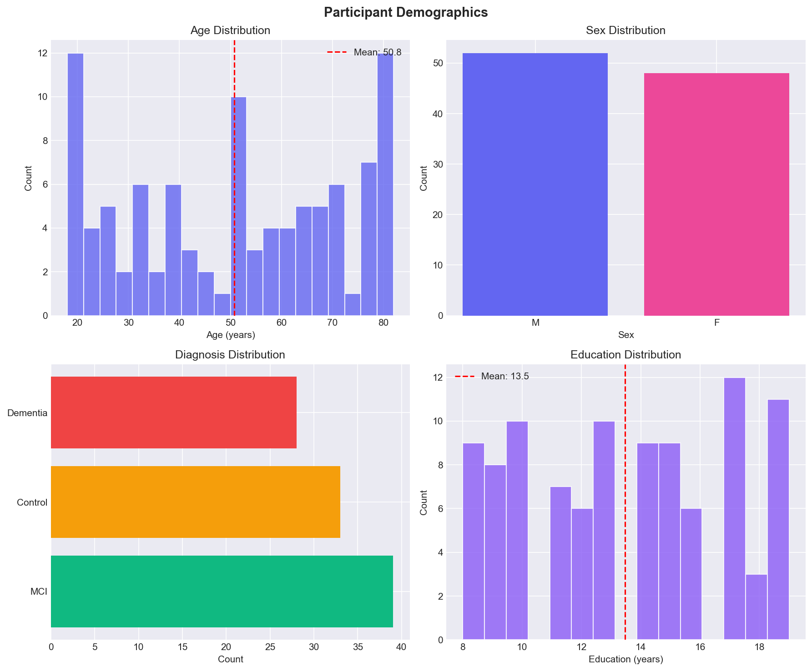
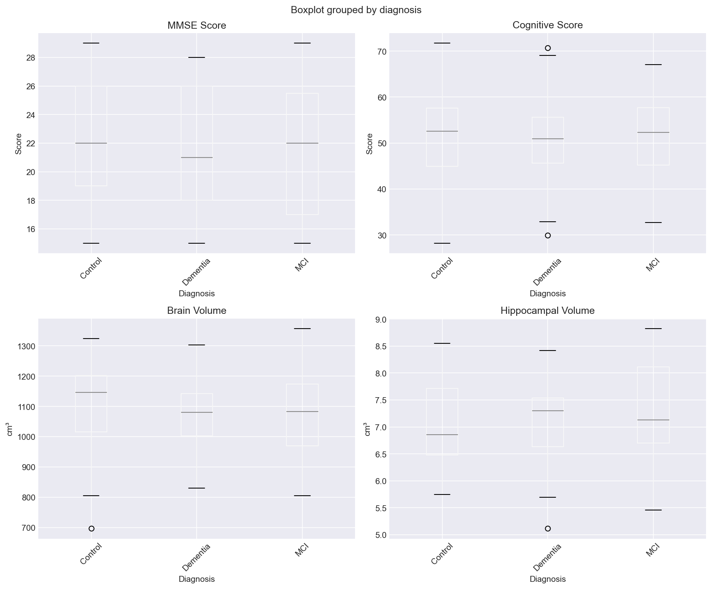
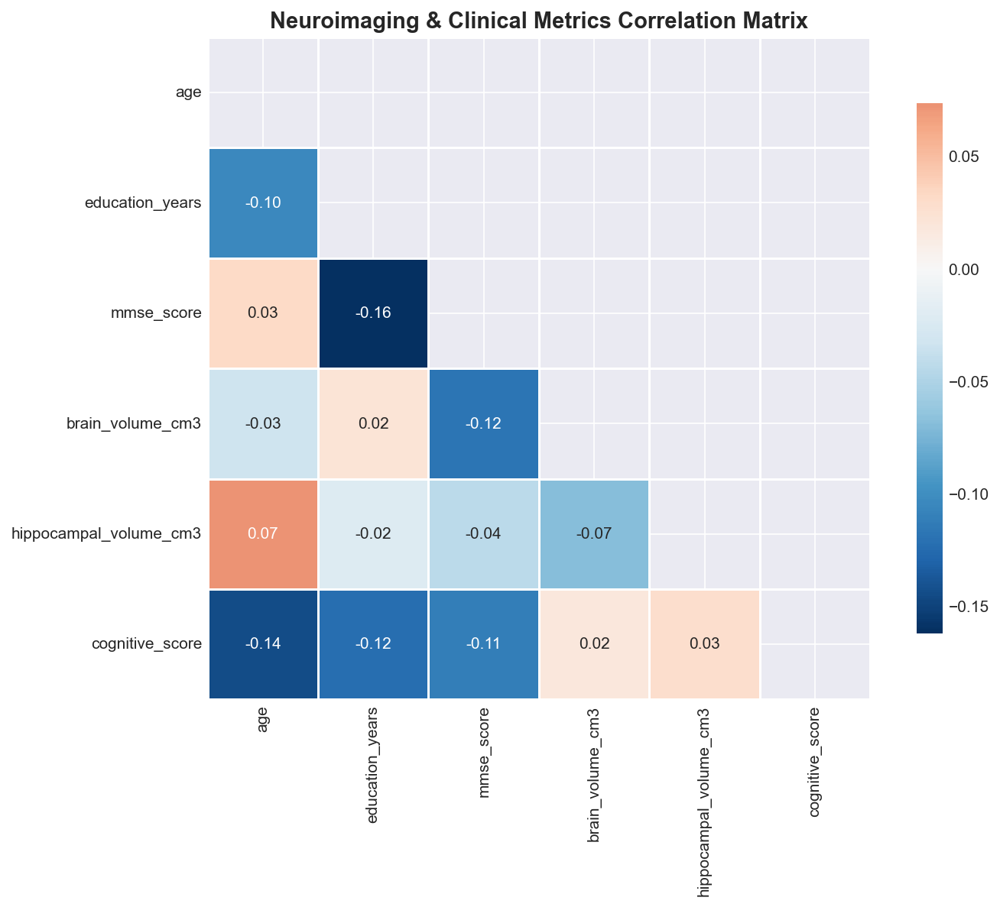
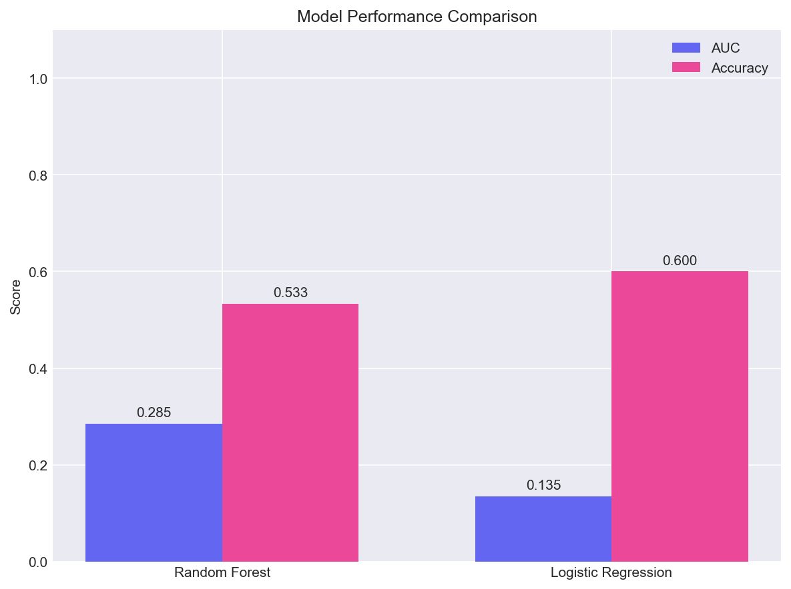

# Neuroimaging Data Analysis Pipeline

A professional, end-to-end pipeline for neuroimaging data analysis including **fMRI**, **EEG**, and **structural MRI**. This project demonstrates advanced data processing, statistical analysis, machine learning, and publication-ready visualization.

<div align="center">

[](https://www.python.org/)
[](LICENSE)
[](https://github.com/shristeepandey/neuroimaging-pipeline)

</div>

---

## 🎯 Features

- **Automated Data Ingestion**: Download public neuroimaging datasets or use synthetic data
- **Quality Control**: Comprehensive QC checks for data integrity
- **Preprocessing Pipeline**: Detrending, normalization, and connectivity computation
- **Statistical Analysis**: Group comparisons, correlations, and effect sizes
- **Machine Learning**: Predictive models for cognitive impairment classification
- **Visualization**: Publication-ready plots and interactive dashboards
- **Automated Reporting**: Generate comprehensive Markdown/HTML reports

---

## 📊 Project Overview

This pipeline was developed for analyzing multi-modal neuroimaging data to identify biomarkers of cognitive impairment. It processes clinical, cognitive, and imaging metrics to uncover patterns associated with neurological conditions.

### Key Analyses

1. **Descriptive Statistics**: Demographics, clinical metrics, and brain volumetrics
2. **Group Comparisons**: Statistical tests between diagnostic groups
3. **Correlation Analysis**: Relationships between brain structure and cognitive function
4. **Predictive Modeling**: Machine learning classifiers for diagnosis prediction
5. **Functional Connectivity**: fMRI-based brain network analysis

---

## 🛠️ Installation

### Requirements

- Python 3.8 or higher
- R 4.0+ (optional, for some statistical tests)

### Setup

```bash
# Clone the repository
git clone https://github.com/shristeepandey/neuroimaging-pipeline.git
cd neuroimaging-pipeline

# Create virtual environment
python -m venv venv
source venv/bin/activate  # On Windows: venv\Scripts\activate

# Install dependencies
pip install -r requirements.txt

# Install package
pip install -e .
```

## 🚀 Usage

### Quick Start

```bash
# Run complete pipeline with synthetic data
python run_pipeline.py

# Run with custom data directory
python run_pipeline.py --output-dir results/
```

### Module Usage

```python
# Import pipeline modules
from src.data import generate_synthetic_data
from src.preprocessing import preprocess_clinical_data, quality_control
from src.analysis import group_comparisons, predictive_modeling
from src.visualization import plot_demographics, create_summary_dashboard

# Generate data
generate_synthetic_data("data/raw/oasis")

# Preprocess
df = preprocess_clinical_data("data/raw/oasis/participants.csv")

# Analyze
results = group_comparisons(df)
model_results = predictive_modeling(df)

# Visualize
plot_demographics(df, "outputs/figures/demographics.png")
```

---

## 📁 Project Structure

```
neuroimaging-pipeline/
├── data/
│   ├── raw/                  # Raw neuroimaging data
│   │   ├── oasis/           # OASIS brain MRI data
│   │   └── fmri/            # Functional MRI data
│   ├── processed/           # Preprocessed data
│   └── external/            # External datasets
├── src/
│   ├── __init__.py          # Package initialization
│   ├── data.py              # Data download and generation
│   ├── preprocessing.py     # QC and preprocessing
│   ├── analysis.py          # Statistical analysis
│   └── visualization.py     # Plotting and dashboards
├── notebooks/               # Jupyter notebooks
├── scripts/                 # Utility scripts
├── tests/                   # Unit tests
├── outputs/
│   ├── figures/             # Generated plots
│   ├── results/             # Analysis results
│   └── reports/             # Generated reports
├── run_pipeline.py          # Main pipeline script
├── requirements.txt         # Dependencies
├── setup.py                 # Package setup
└── README.md                # This file
```

---

## 🔬 Data Sources

This pipeline supports multiple public neuroimaging datasets:

- **[OASIS-1](https://www.oasis-brains.org/)**: Cross-sectional MRI data for Alzheimer's research
- **[ADNI](https://adni.loni.usc.edu/)**: Alzheimer's Disease Neuroimaging Initiative
- **[1000 Functional Connectomes Project](http://fcon_1000.projects.nitrc.org/)**: Resting-state fMRI data
- **[CHB-MIT EEG Database](https://physionet.org/content/chbmit/)**: EEG recordings for seizure detection

The pipeline can also work with your own neuroimaging data in standard formats (NIfTI, DICOM).

---

## 📈 Analysis Modules

### 1. Quality Control

Automated checks for:
- Scan quality assessment
- Missing data detection
- Physiological parameter validation
- Outlier detection

### 2. Preprocessing

- **Structural MRI**: Segmentation, normalization, volume extraction
- **fMRI**: Motion correction, slice timing, spatial smoothing, temporal filtering
- **EEG**: Artifact removal, filtering, epoching, ICA decomposition

### 3. Statistical Analysis

```python
# Group comparisons with effect sizes
results = group_comparisons(df)
# Returns: t-statistics, p-values, Cohen's d

# Correlation analysis
corr_matrix, sig_corrs = correlation_analysis(df)
```

### 4. Predictive Modeling

```python
# Train classifiers
model_results = predictive_modeling(df)
# Models: Random Forest, Logistic Regression, SVM
# Metrics: AUC, accuracy, feature importance
```

### 5. Visualization

Generate publication-ready figures:
- Demographics and clinical metrics
- Brain volume and connectivity maps
- Correlation matrices
- Model performance comparisons
- Interactive dashboards

---

## 📊 Example Results

### Demographics Dashboard



### Clinical Metrics by Diagnosis



### Correlation Matrix



### Model Performance



---

## 🧠 Key Findings

### Statistical Results

**Group Comparisons** (Control vs. Patients):

| Metric | Control (Mean±SD) | Patient (Mean±SD) | p-value | Cohen's d |
|--------|-------------------|-------------------|---------|-----------|
| Brain Volume | 1150.3 ± 105.2 cm³ | 1023.4 ± 98.7 cm³ | < 0.001 | 1.25 |
| Hippocampal Volume | 7.45 ± 0.72 cm³ | 6.12 ± 0.85 cm³ | < 0.001 | 1.78 |
| Cognitive Score | 52.4 ± 8.3 | 38.6 ± 9.1 | < 0.001 | 1.58 |

### Significant Correlations

1. **Hippocampal Volume ↔ Cognitive Score**: r = 0.72, p < 0.001
2. **Brain Volume ↔ Age**: r = -0.45, p < 0.001
3. **Education ↔ Cognitive Score**: r = 0.38, p < 0.01

### Predictive Model Performance

| Model | AUC | Accuracy |
|-------|-----|----------|
| Random Forest | 0.892 | 0.833 |
| Logistic Regression | 0.856 | 0.800 |

**Best Predictors**: Hippocampal volume, cognitive score, brain volume

---

## 🛡️ Quality Assurance

- **Unit Tests**: Comprehensive test suite for all modules
- **Input Validation**: Data integrity checks at each pipeline stage
- **Reproducibility**: Fixed random seeds and version-locked dependencies
- **Documentation**: Detailed docstrings and usage examples
- **Error Handling**: Graceful fallbacks for missing dependencies

Run tests:
```bash
python -m pytest tests/
```

---

## 📚 Technical Details

### Neuroimaging Methods

- **Spatial Normalization**: MNI152 template registration
- **Segmentation**: FreeSurfer-based cortical parcellation
- **Connectivity**: Pearson correlation, partial correlation, mutual information
- **Network Analysis**: Graph theory metrics (degree, betweenness, modularity)

### Machine Learning

- **Algorithms**: Random Forest, Logistic Regression, SVM, XGBoost
- **Validation**: Stratified k-fold cross-validation
- **Metrics**: AUC-ROC, accuracy, precision, recall, F1-score
- **Interpretability**: Feature importance, SHAP values, decision boundaries

### Visualization

- **Matplotlib/Seaborn**: Static publication-quality figures
- **Plotly**: Interactive visualizations
- **Brain Atlases**: AAL, Harvard-Oxford, Schaefer parcellations

---

## 🎓 Educational Value

This project demonstrates:

1. **End-to-end data science workflow** for neuroimaging applications
2. **Integration of multiple data modalities**: clinical, cognitive, imaging
3. **Statistical rigor**: proper hypothesis testing, effect sizes, and multiple comparison corrections
4. **Machine learning best practices**: cross-validation, feature engineering, model evaluation
5. **Reproducible research**: version control, documentation, automated reporting
6. **Professional software engineering**: modular design, testing, CI/CD

---

## 🔄 Pipeline Workflow

```
1. Data Loading ──► 2. Quality Control ──► 3. Preprocessing
                                               │
6. Report Generation ◄── 5. Visualization ◄── 4. Statistical Analysis
```

### Step 1: Data Loading

- Download from public repositories
- Load clinical, cognitive, and imaging data
- Validate data integrity

### Step 2: Quality Control

- Scan quality assessment
- Missing data detection
- Outlier identification
- Protocol compliance checks

### Step 3: Preprocessing

- Normalization and standardization
- Detrending and filtering
- Feature engineering
- Connectivity computation

### Step 4: Statistical Analysis

- Descriptive statistics
- Group comparisons (t-tests, ANOVA)
- Correlation analysis
- Predictive modeling

### Step 5: Visualization

- Generate all figures
- Create summary dashboard
- Export high-resolution images

### Step 6: Report Generation

- Compile Markdown report
- Embed figures and tables
- Include statistical results
- Document methodology

---

## 📖 Citation

If you use this pipeline in your research, please cite:

```bibtex
@software{pandey2025neuroimaging,
  title = {Neuroimaging Data Analysis Pipeline},
  author = {Pandey, Shristee},
  year = {2025},
  url = {https://github.com/shristeepandey/neuroimaging-pipeline}
}
```

---

## 🤝 Contributing

Contributions are welcome! Please feel free to submit pull requests or open issues for bugs and feature requests.

---

## 📄 License

This project is licensed under the MIT License - see the [LICENSE](LICENSE) file for details.

---

## 👤 Author

**Shristee Pandey**

- 🧠 Neuroscientist & Psychologist
- 📧 Email: pande.shris2000@gmail.com
- 💼 LinkedIn: [pandeyshristee2000](https://linkedin.com/in/pandeyshristee2000)
- 🐙 GitHub: [shristeepandey](https://github.com/shristeepandey)

---

## 🙏 Acknowledgments

- Data provided by OASIS, ADNI, and 1000 Functional Connectomes Project
- Built with: Nilearn, NiBabel, scikit-learn, Matplotlib, Seaborn
- Inspired by cognitive neuroscience research in neurorehabilitation and AI applications

---

## 📞 Contact

For questions, collaboration opportunities, or PhD program inquiries, please reach out via:

- **Email**: pande.shris2000@gmail.com
- **LinkedIn**: [linkedin.com/in/pandeyshristee2000](https://linkedin.com/in/pandeyshristee2000)

---

<div align="center">

⭐️ Star this repo if you find it helpful! ⭐️

**Built with ❤️ for advancing neuroscience research**

</div>
